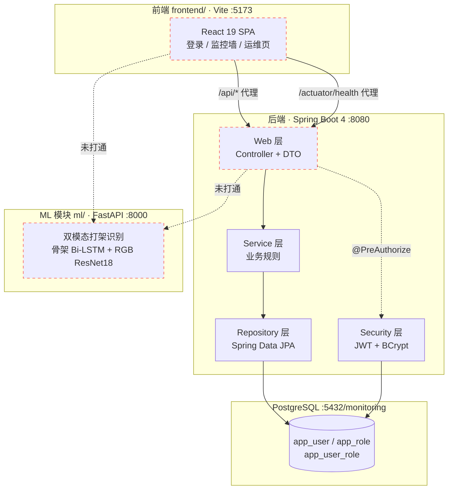
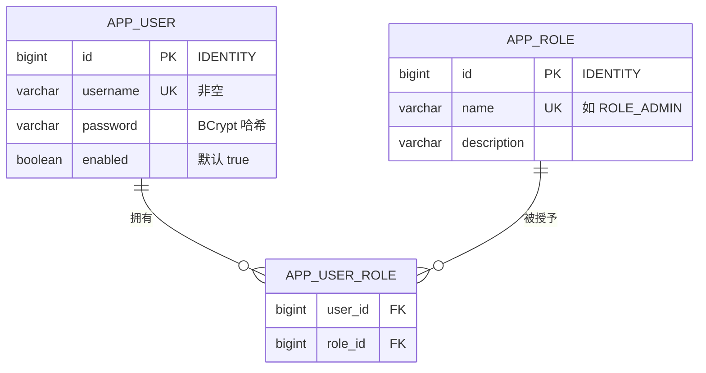
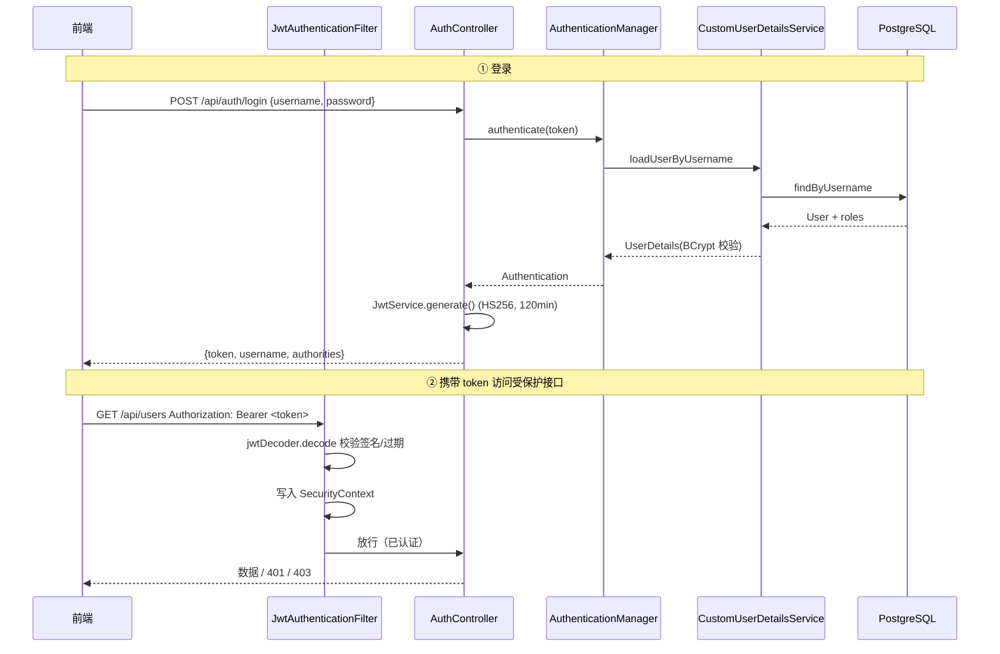
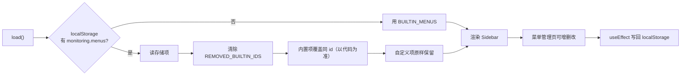
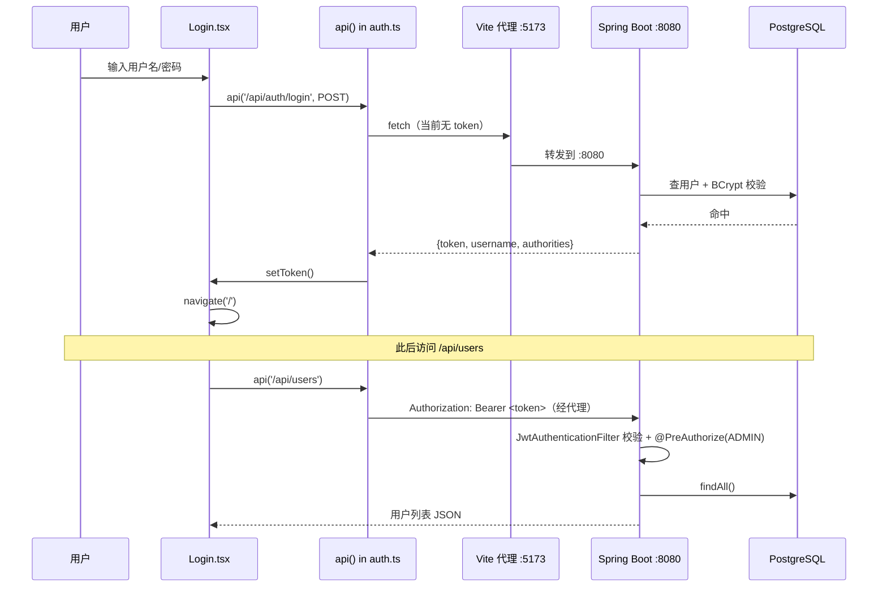
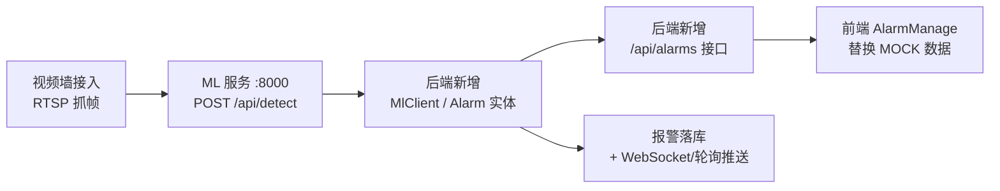

# 监控平台 — 系统架构说明

> [!abstract] 一句话概览
> 面向校园/社区视频监控的一体化平台：**Java 后端（Spring Boot 4 + JDK 27）** 提供用户/角色/权限管理，
> **React 19 前端** 提供监控墙与运维界面，**Python ML 模块** 提供双模态打架识别。
> 三者当前是**独立部署的三个模块**，尚未全部打通（详见 [[#七、模块打通现状与缺口|第七节]]）。

- 项目根：`monitoring-platform/`
- 后端端口 `8080`｜前端 dev `5173`｜ML 服务 `8000`

---

## 一、技术栈总览

### 1.1 后端

| 项 | 版本 / 选型 | 说明 |
|---|---|---|
| JDK | **27** | `java.version=27`、`maven.compiler.release=27` |
| Spring Boot | **4.0.0** | 继承 `spring-boot-starter-parent` |
| 构建 | Maven | `spring-boot-maven-plugin` |
| Web | `spring-boot-starter-web` | REST 控制器 |
| 持久化 | `spring-boot-starter-data-jpa` + PostgreSQL | `ddl-auto=update` |
| 安全 | `spring-boot-starter-security` + `oauth2-jose` | JWT（HS256） |
| 运维 | `spring-boot-starter-actuator` | 健康探针 |
| 测试 | `spring-boot-starter-test` | — |

### 1.2 前端

| 项 | 版本 / 选型 |
|---|---|
| React | **19.3** |
| 路由 | `react-router-dom` **7.18** |
| 构建 | Vite **8.3** |
| 语言 | TypeScript |
| 样式 | 单个 `index.css`（**1082 行**，无 UI 库，图标内联 SVG） |

### 1.3 ML 模块（独立）

Python + PyTorch + FastAPI + Ultralytics。详见 [[打架识别-训练与数据说明]]。

---

## 二、模块总览



> [!warning] 关键事实
> 图中两条虚线是**尚未实现的集成**：前端和后端目前都**没有调用 ML 服务**。
> 监控墙的「打架报警」目前是前端写死的演示数据（详见第七节）。

---

## 三、后端架构

### 3.1 包结构

根包 `com.example.monitoring`，按**分层 + 领域**组织：

```
src/main/java/com/example/monitoring/
├── MonitoringPlatformApplication.java   # @SpringBootApplication 启动类
├── domain/                              # JPA 实体
│   ├── User.java                        # 用户（app_user）
│   └── Role.java                        # 角色（app_role）
├── repository/                          # Spring Data JPA
│   ├── UserRepository.java              # findByUsername / existsByUsername
│   └── RoleRepository.java              # findByName
├── service/                             # 业务逻辑
│   ├── UserService.java                 # 用户 CRUD + 开放注册
│   └── RoleService.java                 # 角色 CRUD
├── security/                            # 认证 / 授权 / 加密
│   ├── SecurityConfig.java              # 安全主配置（FilterChain）
│   ├── JwtService.java                  # 签发 JWT
│   ├── JwtAuthenticationFilter.java     # 解析 Bearer token
│   ├── CustomUserDetailsService.java    # 用户 → UserDetails
│   ├── RsaKeyService.java               # RSA 密钥对（未接入）
│   ├── EncryptedPayloadService.java     # 密文解密 + 防重放（未接入）
│   └── DataInitializer.java             # 启动播种角色与 admin
└── web/                                 # REST 控制器
    ├── AuthController.java              # /api/auth/*
    ├── UserController.java              # /api/users/*
    ├── RoleController.java              # /api/roles/*
    ├── HealthController.java            # /health
    └── dto/                             # 12 个 record DTO
```

**设计要点**：Controller 只做参数接收与编排，业务规则下沉到 Service；DTO 用 **Java record**（不可变、简洁），实体不直接暴露给前端。

### 3.2 数据模型



- `User.roles` 与 `Role.users` 是 **`@ManyToMany` 双向关联**，中间表 `app_user_role`。
- `User` 侧 `fetch = FetchType.EAGER`——认证时需立即取角色，避免 `LazyInitializationException`。
- 表结构由 `ddl-auto: update` **自动建/改**，无手写 DDL / 迁移脚本。

> [!tip] 为什么 EAGER
> `CustomUserDetailsService.loadUserByUsername` 在事务外构造 `UserDetails`，
> 若角色懒加载会报错。代价是每次查用户都多一次 join。

### 3.3 安全架构（核心）

#### 认证流程



#### 关键配置

| 配置项 | 值 / 行为 |
|---|---|
| 会话策略 | `SessionCreationPolicy.STATELESS`（无状态，不建 HttpSession） |
| CSRF | 关闭（纯 token API，无 cookie 会话） |
| JWT 算法 | HS256，密钥来自 `app.security.jwt.secret` |
| JWT 有效期 | `expiration-minutes: 120` |
| 密码编码 | `BCryptPasswordEncoder` |
| 放行路径 | `/actuator/health`、`/health`、`/error`、`/api/auth/register`、`/api/auth/login` |
| 其余请求 | `anyRequest().authenticated()` |
| 方法级鉴权 | `@EnableMethodSecurity` + `@PreAuthorize("hasRole('ADMIN')")` |

> [!note] JWT 只签发业务角色
> `JwtService.generate` 里用 `.filter(a -> a.startsWith("ROLE_"))` 过滤，
> 避免把 Spring Security 内部 authority（如 `FACTOR_PASSWORD`）写进 token 的 `authorities` claim。

`JwtAuthenticationFilter` **刻意不加 `@Component`**——若被 Spring 自动注册为全局 Servlet Filter，
会与 Security 链中的注册**重复执行**。它由 `SecurityConfig` 手动 `new` 并 `addFilterBefore`。

#### 启动播种（DataInitializer）

应用启动（`ApplicationRunner`）时幂等地创建：

| 对象 | 值 | 备注 |
|---|---|---|
| 角色 | `ROLE_ADMIN`（管理员）、`ROLE_USER`（普通用户） | 已存在则复用 |
| 用户 | `admin` / `admin123` | **仅当不存在时创建**，拥有两个角色 |

> [!danger] 上线前必须处理
> 默认账号 `admin/admin123`、明文 JWT secret、数据库口令都写在 `application.yml` 里。
> 生产环境必须改为**环境变量注入**并更换密钥。

### 3.4 REST API 一览

| 方法 | 路径 | 权限 | 说明 |
|---|---|---|---|
| GET | `/health` | 公开 | 自定义健康检查（返回 `{status, service}`） |
| GET | `/actuator/health` | 公开 | Actuator 健康（含 DB 探针，`show-details: always`） |
| POST | `/api/auth/register` | 公开 | 注册，**强制仅 `ROLE_USER`** |
| POST | `/api/auth/login` | 公开 | 登录，返回 JWT |
| POST | `/api/auth/logout` | 认证 | 清空 `SecurityContext`（无状态，仅前端丢 token） |
| GET | `/api/auth/me` | 认证 | 当前用户与角色 |
| GET | `/api/users` | ADMIN | 用户列表 |
| POST | `/api/users` | ADMIN | 新建用户 |
| PUT | `/api/users/{id}` | ADMIN | 更新用户（密码/启用/角色） |
| DELETE | `/api/users/{id}` | ADMIN | 删除用户 |
| GET | `/api/users/me` | 认证 | 同 `/api/auth/me` |
| GET | `/api/roles` | ADMIN | 角色列表 |
| POST | `/api/roles` | ADMIN | 新建角色 |
| DELETE | `/api/roles/{id}` | ADMIN | 删除角色 |

> [!tip] 防提权的关键设计
> `UserService.register()` **硬编码只授予 `ROLE_USER`**，
> 不接受前端传入的角色，杜绝通过注册接口把自己变成 ADMIN：
> ```java
> Role userRole = roleRepository.findByName("ROLE_USER")...;
> user.setRoles(Set.of(userRole));   // 忽略任何传入的角色
> ```

### 3.5 配置文件

`src/main/resources/application.yml`：

```yaml
app:
  security:
    jwt:
      secret: monitoring-platform-default-jwt-secret-please-change-in-production
      expiration-minutes: 120

spring:
  datasource:
    url: jdbc:postgresql://127.0.0.1:5432/monitoring
    username: monitoring
    password: Monitor@2026
  jpa:
    hibernate:
      ddl-auto: update        # 自动建表/改表，无迁移脚本

server:
  port: 8080

management:
  endpoints:
    web:
      exposure:
        include: health,info,metrics
  endpoint:
    health:
      show-details: always    # 前端仪表盘据此展示各组件明细
      probes:
        enabled: true         # 暴露 liveness/readiness
```

---

## 四、前端架构

### 4.1 目录结构

```
frontend/
├── index.html                # 挂载点 #root
├── vite.config.ts            # dev 代理 /api、/actuator -> :8080
├── tsconfig.json
└── src/
    ├── main.tsx              # 入口：StrictMode + BrowserRouter
    ├── App.tsx               # 布局 + 路由表
    ├── auth.ts               # token 存取 + api() 统一封装
    ├── index.css             # 全局样式（1082 行）
    ├── components/
    │   ├── Sidebar.tsx       # 动态菜单侧边栏
    │   └── Topbar.tsx        # 顶栏（用户信息 + 退出）
    ├── menu/
    │   ├── types.ts          # Menu 类型
    │   └── useMenus.ts       # 菜单状态（localStorage 持久化）
    └── pages/
        ├── Login.tsx         # 登录 / 注册（独立全屏）
        ├── VideoWall.tsx     # 视频监控墙（主页面）
        ├── Dashboard.tsx     # 仪表盘（轮询 actuator/health）
        ├── UserManage.tsx    # 人员管理（调后端）
        ├── MenuManage.tsx    # 菜单管理（纯前端）
        ├── AlarmManage.tsx   # 报警管理（演示数据）
        ├── RecycleManage.tsx # 回收站（演示数据）
        └── Placeholder.tsx   # 未实现路由兜底
```

### 4.2 路由表

| 路径 | 组件 | 数据来源 | 权限 |
|---|---|---|---|
| `/login` | `Login` | 后端 `/api/auth/*` | 公开（独立全屏布局） |
| `/` | `VideoWall` | **前端演示数据** | 需登录 |
| `/dashboard` | `Dashboard` | 后端 `/actuator/health` | 需登录 |
| `/menu` | `MenuManage` | **localStorage** | 需登录 |
| `/users` | `UserManage` | 后端 `/api/users` | 需 ADMIN |
| `/alarms` | `AlarmManage` | **前端演示数据** | 需登录 |
| `/recycle` | `RecycleManage` | **前端演示数据** | 需登录 |
| `*` | `Placeholder` | — | 兜底 |

> [!note] 布局分流
> `App.tsx` 中 `/login` 直接 `return <Login />` **不套侧边栏**；
> 其余路由统一走 `Sidebar + Topbar + content` 的壳。

### 4.3 认证与请求封装

`src/auth.ts` 是前端与后端安全体系的唯一衔接点：

```ts
const TOKEN_KEY = 'monitoring.token'

export function authHeaders(): Record<string, string> {
  const token = getToken()
  return token ? { Authorization: 'Bearer ' + token } : {}
}

/** 统一请求封装：自动附带 JWT，遇 401 时清空本地 token */
export async function api(path: string, opts: RequestInit = {}): Promise<Response> {
  const res = await fetch(path, {
    ...opts,
    headers: { ...(opts.headers || {}), ...authHeaders() },
  })
  if (res.status === 401) clearToken()
  return res
}
```

**要点**：
- token 存 `localStorage`（键 `monitoring.token`），刷新页面不丢登录态。
- 所有业务请求都走 `api()`，自动带 `Authorization`，401 自动清 token（下次跳登录）。
- 401 → 跳登录、403 → 显示「无权访问」，这套处理在 `UserManage.tsx` 里有完整体现。

### 4.4 动态菜单机制

菜单**完全由前端管理**，不走后端：



- 内置菜单 5 项：视频监控 `/`、仪表盘 `/dashboard`、人员管理 `/users`、报警管理 `/alarms`、回收站 `/recycle`。
- **以代码为准**：内置菜单每次加载覆盖同 id 的存储项，保证改了代码能生效；自定义菜单保留。
- **历史清理**：`REMOVED_BUILTIN_IDS`（含 `m-menu`）在加载时删除，避免残留旧菜单。
- 删除父菜单时**级联删除子菜单**。

> [!warning] 一致性缺口
> 菜单是**纯前端 localStorage**，而权限在**后端**。可能出现「菜单可见但接口 403」或
> 「菜单隐藏但接口可调」的不一致。要做真正的菜单级权限，需把菜单表下沉到后端。

### 4.5 开发代理

`vite.config.ts` 把 `/api` 与 `/actuator` 代理到 `http://localhost:8080`：

```ts
server: {
  port: 5173,
  proxy: {
    '/api':      { target: 'http://localhost:8080', changeOrigin: true },
    '/actuator': { target: 'http://localhost:8080', changeOrigin: true },
  },
},
```

**为何保留路径前缀**（不做 rewrite）：与后端真实路径完全一致，避免「本地能跑、上线 404」。

---

## 五、数据流

### 5.1 登录与拉取用户（端到端）



### 5.2 仪表盘健康轮询

`Dashboard.tsx` 每 **5 秒** `fetch('/actuator/health')`，渲染整体状态与各组件（`db`、`diskSpace`、`ping`…）。
沿用 `show-details: always`，因此前端能拿到组件明细。

---

## 六、运行与部署

### 6.1 一键脚本

`bin/start.sh`（`setsid` 脱离会话常驻，日志落 `logs/`）：

```bash
export JAVA_HOME=/opt/dev/jdk/jdk-27
setsid bash -c "cd '$ROOT' && mvn -q spring-boot:run > logs/backend.log 2>&1" &
setsid bash -c "cd '$ROOT/frontend' && npm run dev > logs/frontend.log 2>&1" &
```

`bin/stop.sh` 用 `pkill -f 'spring-boot:run'` / `pkill -f 'vite'` 停止。

| 服务 | 地址 |
|---|---|
| 后端 | http://localhost:8080 |
| 前端 | http://localhost:5173 |
| ML 服务 | http://localhost:8000（独立启动，见 [[打架识别-训练与数据说明]]） |

### 6.2 前置依赖

| 依赖 | 说明 |
|---|---|
| JDK 27 | `start.sh` 硬编码 `JAVA_HOME=/opt/dev/jdk/jdk-27` |
| Maven | 构建/运行后端 |
| Node + npm | 构建/运行前端 |
| PostgreSQL | 需先建库 `monitoring`，账号 `monitoring`/`Monitor@2026` |

> [!note] 无容器化
> 项目内**没有** Dockerfile / docker-compose / K8s 清单，部署依赖 `bin/*.sh`。
> 环境变量也未外置，配置全部在 `application.yml` 中。

---

## 七、模块打通现状与缺口

> [!important] 本节是本项目最需要注意的部分
> 三个模块（后端 / 前端 / ML）在**代码层面基本独立**，多处仍是演示数据或未接入代码。

### 7.1 已打通 ✅

| 能力 | 状态 |
|---|---|
| 登录 / 注册 / JWT 签发校验 | ✅ 前后端贯通，实测可用 |
| 用户 CRUD（ADMIN 限定） | ✅ `UserManage` ↔ `/api/users` |
| 角色 CRUD | ✅ 接口就绪 |
| 仪表盘健康监控 | ✅ `Dashboard` ↔ `/actuator/health` |
| 动态菜单增删改 | ✅（但仅前端 localStorage） |

### 7.2 未打通 / 待实现 ⚠️

| 项 | 现状 | 说明 |
|---|---|---|
| **前端 ↔ ML 服务** | ❌ 无调用 | 监控墙「打架报警」是写死的 `MOCK_ALARMS` |
| **后端 ↔ ML 服务** | ❌ 无调用 | `src/` 中无任何 `:8000` / `predict` 引用 |
| **报警管理** | ⚠️ 演示数据 | `AlarmManage.tsx` 的 `INITIAL_ALARMS` 为前端常量 |
| **回收站** | ⚠️ 演示数据 | `RecycleManage.tsx` 的人员/设备均为常量 |
| **视频墙** | ⚠️ 无真实视频 | 只有摄像机占位图，无 RTSP/流接入 |
| **RSA 加密登录** | ❌ 已实现未接入 | 见下 |

> [!failure] RSA 加密登录：代码完整，但从未被调用
> 后端已实现一套完整的前端公钥加密登录：
> - `RsaKeyService`：启动生成 RSA-2048 密钥对，暴露 PEM 公钥，提供 `decrypt`
> - `EncryptedPayloadService`：解密 `{p,t,n}` 载荷，校验**时间戳（±5min）+ nonce 防重放**
> - `PublicKeyResponse` DTO、以及 `LoginRequest`/`RegisterRequest`/`UserCreateRequest`/`UserUpdateRequest`
>   都预留了 `keyId` 字段（注释写的是「经公钥加密后的密码密文」）
>
> **但是**：
> 1. **没有任何 Controller 引用** `RsaKeyService` / `EncryptedPayloadService`
>    （全局搜索仅在这两个类自身内出现）；
> 2. **没有暴露公钥的端点**（`PublicKeyResponse` 定义了却无处返回）；
> 3. `AuthController.login` 把 `req.password()` **当明文**直接交给 `AuthenticationManager`；
> 4. 前端 `Login.tsx` 发送的是**明文密码**，无任何加密逻辑（无 jsencrypt 依赖）。
>
> **结论**：这套加密能力是**半成品/预留代码**，当前登录仍是明文传输（依赖 HTTPS 兜底）。
> 要么补完（加 `/api/auth/public-key` 端点 + 前端加密），要么明确移除，避免误导。

### 7.3 建议的补全路径



1. **后端补一层 ML 客户端**（如 `MlDetectionClient`），封装对 `:8000/api/detect` 的调用；
2. **新增 `Alarm` 实体与 `/api/alarms`**，把打架检出落库；
3. **前端 `AlarmManage` / `VideoWall` 改调后端**，去掉 `MOCK_ALARMS` / `INITIAL_ALARMS`；
4. **决定 RSA 加密登录的去留**；
5. **配置外置**（JWT secret、DB 口令、默认账号）到环境变量。

---

## 八、代码亮点

> [!tip] 值得保留的工程实践
> - **防提权注册**：`register()` 硬编码只给 `ROLE_USER`。
> - **JWT 只装业务角色**：过滤掉 Spring 内部 authority。
> - **过滤器不进容器**：`JwtAuthenticationFilter` 不加 `@Component`，避免重复注册。
> - **DTO 用 record**：不可变、无样板代码。
> - **前端统一请求封装**：`api()` 集中处理 token 与 401。
> - **菜单「以代码为准」**：内置菜单覆盖存储项，改代码即生效。
> - **代理保留路径前缀**：本地与线上路径一致，避免 404。

## 九、代码规模

| 模块 | 规模 |
|---|---|
| 后端 Java | 28 个文件，约 **963 行** |
| 前端 TS/TSX | 15 个源文件 + `index.css` **1082 行** |
| ML 模块 | 19 个 Python 文件（见 [[打架识别-训练与数据说明]]） |

---

## 相关文档

- [[打架识别-训练与数据说明]] — ML 模块的数据集、训练与核心代码
- `README.md`（ml/）— ML 模块总览

## 关键文件索引

| 关注点 | 文件 |
|---|---|
| 启动类 | `src/main/java/com/example/monitoring/MonitoringPlatformApplication.java` |
| 安全总配置 | `src/main/java/com/example/monitoring/security/SecurityConfig.java` |
| JWT 签发/解析 | `security/JwtService.java`、`security/JwtAuthenticationFilter.java` |
| 登录接口 | `web/AuthController.java` |
| 用户业务 | `service/UserService.java` |
| 数据模型 | `domain/User.java`、`domain/Role.java` |
| 应用配置 | `src/main/resources/application.yml` |
| 前端入口 | `frontend/src/main.tsx`、`frontend/src/App.tsx` |
| 前端认证 | `frontend/src/auth.ts` |
| 菜单机制 | `frontend/src/menu/useMenus.ts` |
| 启动脚本 | `bin/start.sh`、`bin/stop.sh` |
