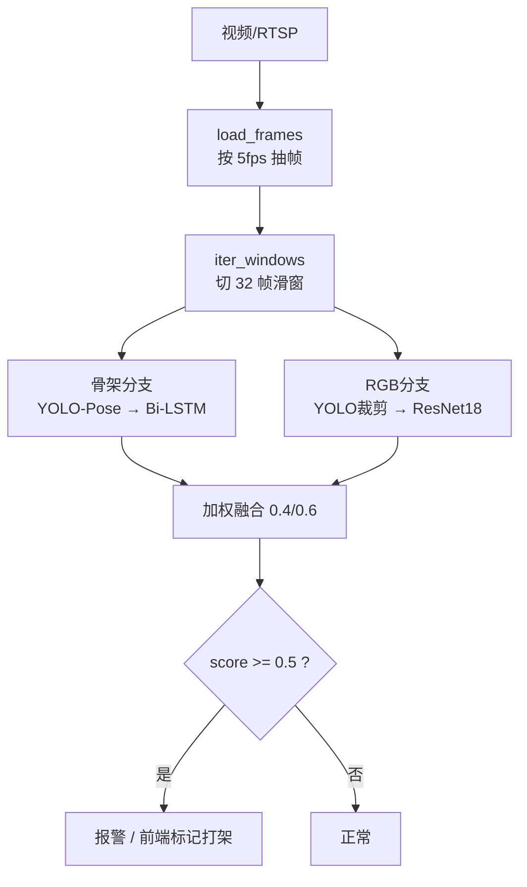

# 打架识别模型 — 数据集、训练过程与核心代码

> [!abstract] 一句话概览
> 监控场景打架识别模块，**双模态集成**（骨骼 Bi-LSTM + RGB ResNet18），
> 训练数据 **4800 段**（4 个公开数据集），生产集成 val F1 **0.926**。
> 代码在 `ml/`，服务由 `ml/inference/service.py` 提供（FastAPI）。

- 代码根目录：`ml/`
- 生产权重：`ml/data/checkpoints/fight_lstm.pt`（骨架）、`ml/data/checkpoints/fight_rgb_resnet18.pt`（RGB）
- 启动服务：`cd ml && . .venv/bin/activate && uvicorn inference.service:app --host 0.0.0.0 --port 8000`

---

## 一、数据集收集

### 1.1 数据源总览

| 数据集 | 规模 | 许可 | 来源 | 定位 |
|---|---|---|---|---|
| RWF-2000 | 2000 | 学术 | GitHub `mchengny/RWF2000-Video-Database-for-Violence-Detection` | 通用现实监控，带人体框，标杆 |
| Hockey Fight | 1000 | 公开 | HF `34data/hockey-fight-videos` | 冰球赛场冲突（`fi_`=打架 / `no_`=非打架） |
| Real-Life Violence (RLVS) | 1500 | 公开 | HF `34data/real-life-violence` | 现实暴力/非暴力（`Violence/` 与 `NonViolence/`） |
| Surveillance (surv) | 300 | 研究 | IPTA 2019 *Vision-based Fight Detection From Surveillance Cameras* | 监控视角，150 fight + 150 nofight |
| UCF-Crime | 100（抽取） | CC0 | HF `jinmang2/ucf_crime` | 真实 CCTV，Fighting 50 + Normal 50，**评测基准** |

> [!info] 为什么是这几个
> 打架是小概率事件，单数据集（如 RWF-2000 仅 2000 段）规模与场景多样性都不足。
> 通过**多域混合**提升泛化：冰球（高对比、固定机位）+ RLVS（手持/现实）+ surv/UCF（监控俯瞰）。
> UCF-Crime 仅取 Fighting/Normal 两类，其余异常类（Burglary、Explosion…）与「打架」语义不符，**不纳入**。

### 1.2 合并后的训练清单

主清单 `data/manifests/all_train.csv`（= RWF-2000 + Hockey + RLVS + surv）：

| split | 打架(1) | 非打架(0) | 合计 |
|---|---|---|---|
| train | 2191 | 1789 | **3980** |
| val | 459 | 361 | **820** |
| 合计 | 2650 | 2150 | **4800** |

各子清单：

| 清单文件 | 总数 | train(0/1) | val(0/1) |
|---|---|---|---|
| `rwf2000.csv` | 2000 | 800 / 800 | 200 / 200 |
| `hockey.csv` | 1000 | 437 / 413 | 63 / 87 |
| `rlvs.csv` | 1500 | 427 / 848 | 73 / 152 |
| `surv.csv` | 300 | 125 / 130 | 25 / 20 |
| `ucf.csv` | 100 | 41 / 39 | 9 / 11 |
| `all_train.csv` | 4800 | 3980 | 820 |

> [!warning] UCF 未并入训练集（有意为之）
> UCF-Crime 是**弱标注**数据集——整条视频只保证「含打架」，无精确起止（时序标注仅覆盖 5 条测试视频）。
> 且 UCF Fighting 平均时长 173s、最长 1055s，直接整段抽帧会混入大量非打架内容而引入噪声。
> 故 `ucf.csv` 仅作为**长视频推理的评测基准**保留，不参与训练。

### 1.3 数据接入流程

统一由 [[scripts/prepare_external.py]] 完成：解压 → 规整目录 → 生成带前缀的 manifest。

> [!tip] 目录约定（与 RWF-2000 一致）
> ```
> data/raw/<name>/{train,val}/{fight,nonfight}/<name>__<orig_stem>.<ext>
> ```
> 文件名前缀（如 `hockey__`、`rlvs__`）用于**跨数据集防重名**，也是按域拆分的依据（`source_of()`）。

```bash
# 压缩包源
python -m scripts.prepare_external --name hockey --zip-dir data/raw/_dl --pattern 'data_*.zip' \
       --out-dir data/raw/hockey --manifest data/manifests/hockey.csv
python -m scripts.prepare_external --name rlvs --zip-dir data/raw/_dl --pattern 'real-life-violence_*.zip' \
       --out-dir data/raw/rlvs --manifest data/manifests/rlvs.csv
# 目录源（git 仓库）
python -m scripts.prepare_external --name surv --src-dir data/raw/surv \
       --out-dir data/raw/surv_ready --manifest data/manifests/surv.csv
python -m scripts.prepare_external --name ucf --zip-dir data/raw/_dl/ucf --pattern '*.zip' \
       --out-dir data/raw/ucf --manifest data/manifests/ucf.csv --val-ratio 0.2
# 合并
python -m scripts.prepare_external --merge data/manifests/rwf2000.csv data/manifests/hockey.csv \
       data/manifests/rlvs.csv data/manifests/surv.csv --manifest data/manifests/all_train.csv
```

标签判定规则（`_label_of`）按数据集名分派：

```python
def _label_of(name: str, rel: str) -> int | None:
    if name == "rlvs":   return _rlvs_label(rel)    # Violence/ -> 1, NonViolence/ -> 0
    if name == "surv":   return _surv_label(rel)    # 目录 fight/ -> 1, noFight/ -> 0
    if name == "ucf":    return _ucf_label(rel)     # Fighting/ -> 1, Normal* -> 0, 其它忽略
    if name == "hockey": return _hockey_label(Path(rel).name)  # fi* -> 1, no* -> 0
    ...
```

> [!note] 一个容易踩的坑
> `merge()` 去重键必须用**完整路径**而非 basename。RWF-2000 的 `train/fight/x.avi` 与
> `train/nonfight/x.avi` 是同名但内容不同的文件，按 basename 去重会**静默丢数据**。

---

## 二、数据预处理管线

两条模态各自独立预处理，产物落盘后训练时直接读 `.npy`（避免每轮重复解码视频）。

### 2.1 方案1 骨架：关键点抽取

[[scripts/extract_keypoints.py]] → 用 YOLO-Pose 对每帧抽关键点：

- 每帧取**面积最大的 K=2 个人**（`top-K`），输出 `(T, K, 17, 3)`，存 `data/keypoints/{split}/{fight,nonfight}/<stem>.npy`
- 同时写 `meta.json`（记录 `k / num_frames / pose_weights / imgsz`）供训练时校验复用

```python
def extract(self, frames) -> np.ndarray:
    """对每帧跑 pose，取面积最大的 K 个人，返回 (T, K, 17, 3)。"""
    results = self.model(list(frames), verbose=False, imgsz=self.imgsz)
    ...
    wh = (res.boxes.xywh[:, 2] * res.boxes.xywh[:, 3]).cpu().numpy()
    order = np.argsort(-wh)[: self.k]     # 按框面积取 top-K
```

### 2.2 方案2 RGB：人体裁剪片段

[[scripts/extract_clips.py]] → YOLO 检测人体 → 裁剪「人所在并集区域」→ 存 RGB 片段：

- 输出 `(T, res, res, 3) uint8`，`res=160`，存 `data/clips/{split}/{fight,nonfight}/<stem>.npy`
- 人体框取所有 person(class 0) 的**并集 + 8% 边距**（`person_union_box`）

```python
def person_union_box(results, W, H, margin=0.08):
    """合并所有 person(class 0) 框; 返回 (x1,y1,x2,y2) 或 None。"""
    for c, b in zip(cls, xyxy):
        if int(c) == 0:  # person
            xs += [b[0], b[2]]; ys += [b[1], b[3]]
    ...
    mx, my = margin * (x2 - x1), margin * (y2 - y1)
    return int(max(0, x1 - mx)), int(max(0, y1 - my)), int(min(W, x2 + mx)), int(min(H, y2 + my))
```

> [!tip] 产物规模
> `data/keypoints` 4800 个（76M）、`data/clips` 4800 个（5.6G）。
> 训练时若 `meta.json` 配置不匹配会自动重抽（`ensure_keypoints`），已存在的默认跳过。

---

## 三、训练过程

### 3.1 方案1：骨架 Bi-LSTM

代码 [[train.py]]，配置见 `configs/default.yaml`。

**特征工程**（每条 32 帧序列 → 每帧 K×17×**6** 通道）：

| 通道 | 含义 |
|---|---|
| x, y | 归一化坐标（骨盆居中、按肩宽缩放）→ **尺度/位置无关** |
| score | 关键点置信度 |
| vx, vy | 帧间速度 → 体现**运动剧烈度**（打架的核心线索） |
| 0 | 占位（对齐 6 通道） |

```python
def normalize_keypoints(kpts):
    """(x,y) 居中到骨盆、按肩宽缩放; score 保留。"""
    pelvis = (out[..., _LHIP, :] + out[..., _RHIP, :]) / 2.0
    scale = np.maximum(np.linalg.norm(out[..., _LSH, :2] - out[..., _RSH, :2], axis=-1), 1e-3)[..., None]
    xy = (out[..., :, :2] - pelvis[..., None, :2]) / scale[..., None, :]

def build_features(kpts_raw):
    """(T,...,17,3) -> (T,...,17,6): x,y,score,vx,vy,0。速度=相邻帧差分。"""
    vel[1:] = xy[1:] - xy[:-1]
    return np.concatenate([xy, score, vel, zero], axis=-1)
```

**模型**（[[models/fight_detector.py]] `TemporalClassifier`）：`Linear(204→96)` → 2 层双向 LSTM → 时间维均值池化 → `Linear(192→96→2)`。

```python
def encode(self, x):
    x = self.embed(x)                    # (B,T,feat) -> (B,T,hidden)
    out, _ = self.lstm(x)                # 双向 LSTM
    return out.mean(dim=1)               # 时间维均值池化 -> (B, hidden*2)
```

**训练设置**：AdamW（lr 1e-3, wd 1e-3）、CosineAnnealing、**类别加权交叉熵**（`--class-weight`，缓解正负不平衡）、标签平滑 0.05、40 epoch、batch 128。按 **val F1 最优**保存权重。

**数据增强**（`KeypointDataset.__getitem__`）：水平翻转（含左右关键点交换）、关键点空间抖动（σ=0.02）、随机时间遮罩。

### 3.2 方案2：RGB 2D CNN

代码 [[train_rgb.py]] + [[models/video_classifier.py]]。

**为什么不用 3D 骨干**（如 R(2+1)D / SlowFast）：在当前 CUDA + Blackwell(sm_120) 组合下 3D 卷积退化为极慢路径（实测 batch4 前后向 >14s），改用 **2D CNN 逐帧（帧当 batch）+ mean/max 时序聚合**，实测快 ~25 倍且更省显存。

```python
class FrameClassifier(nn.Module):
    """输入 (B,T,C,H,W): 2D 骨干逐帧 -> (B,T,feat) -> mean+max 聚合 -> FC。"""
    def forward(self, x):
        B, T = x.shape[:2]
        f = self.backbone(x.reshape(B * T, *x.shape[2:]))     # (B*T, feat)
        f = f.reshape(B, T, -1)
        z = torch.cat([f.mean(dim=1), f.max(dim=1).values], dim=1)  # 时序聚合
        return self.head(z)
```

**骨干**：ImageNet 预训练 ResNet18（`pretrained=True`），输入 16 帧、160×160、ImageNet 归一化。
**训练设置**：AdamW（lr 1e-4）、CosineAnnealing、类别加权、20 epoch、batch 32，按 val F1 保存。

### 3.3 自监督预训练（结论：无增益）

[[pretrain.py]] 实现了 SimCLR 式时序对比预训练（NT-Xent 损失，随机时间裁剪/重采样 + 翻转 + 抖动），产物 `encoder_pretrained.pt`。

> [!failure] 负面结论：同域预训练无效
> | 训练标签量 | 从零训练 F1 | SSL 预训练 F1 | 差异 |
> |---|---|---|---|
> | 100%（1600） | **0.826** | 0.798 | −0.028 |
> | 20%（320） | **0.761** | 0.737 | −0.024 |
>
> **原因**：预训练数据与微调数据是同一批视频，编码器未获得新信息。
> SSL 要有效，**预训练数据必须来自当前数据之外**（如 UCF-Crime / Kinetics）。
> 该权重仅作实验产物保留，**生产不用**。

---

## 四、val 集是怎么设计的

### 4.1 划分策略

- **RWF-2000 / UCF**：沿用数据集官方 train/val 划分。
- **Hockey / RLVS / surv**：按 `val_ratio`（默认 0.15）随机划分，**固定种子 42**（`random.Random(seed)`）保证可复现。
- 每数据集**独立划分后再合并**，避免某集全部落入某一 split。

### 4.2 按域拆分评估（关键设计）

跨数据集合并后，val 集**混合了多个域**，整体指标与「RWF-only val」**不可直接比较**。因此 [[eval.py]] 提供**按数据集来源拆解**：

```python
def source_of(name: str) -> str:
    """按文件名前缀判定数据集来源(rwf 无前缀)。"""
    if name.startswith("hockey__"): return "hockey"
    if name.startswith("rlvs__"):   return "rlvs"
    if name.startswith("surv__"):   return "surv"
    return "rwf"
```

`report()` 逐域打印 acc/F1/prec/rec 后再给 ALL，这样能一眼看出**哪个域是短板**。

```bash
python -m eval --manifest data/manifests/all_train.csv
```

> [!important] 小样本域的统计陷阱
> `surv` val 仅 45 条，bootstrap 95% 置信区间宽达 ±0.15。
> 在该 val 上不同融合权重的区间**完全重叠**——任何「提升」都无法与噪声区分。
> 因此**不可**据此在小域上调参（这也是我们放弃 surv 域调参的原因，见第六节）。

### 4.3 指标演进（val）

| 版本 | 训练数据 | 骨架 F1 | RGB F1 | 集成 F1 |
|---|---|---|---|---|
| v1（单人 51 维） | RWF 1600 | 0.727 | — | — |
| v2（top-2 + 速度 + 增强） | RWF 1600 | 0.826 | 0.828 | 0.863 |
| **v3（多域混合，线上）** | **4800** | **0.854** | **0.911** | **0.926** |

**v3 按域拆分**（val 820 段）：

| 模型 | RWF | Hockey | RLVS | surv | ALL |
|---|---|---|---|---|---|
| 骨架 | 0.800 | 0.862 | 0.940 | 0.703 | 0.854 |
| RGB | 0.844 | 0.989 | 0.984 | 0.723 | 0.911 |
| **集成 w_sk=0.4** | **0.862** | **0.994** | **0.990** | **0.791** | **0.926** |

> [!note] 一个诚实的发现
> 多域混合训练后，*骨架单模态*在 RWF 域上从 0.826 **略降到 0.800**（跨域模式稀释），
> 但 RGB 分支与集成都更强。生产默认走集成，不受影响。

---

## 五、核心代码

### 5.1 集成推理（生产默认）

[[models/ensemble_detector.py]] `EnsembleFightDetector`：骨架 + RGB **概率加权融合**，**任一权重缺失自动降级为单模态**。

```python
def predict_video(self, frames) -> EnsembleResult:
    sk  = self.skeleton.predict_video(frames) if self.skeleton else None
    rgb = self.rgb.predict_video(frames)      if self.rgb      else None
    if sk is not None and rgb is not None:
        w = self.skeleton_weight                        # 默认 0.4（多数据集实测最优）
        score = w * sk.score + (1.0 - w) * rgb.score
    elif sk is not None: score = sk.score
    else:                score = rgb.score
```

### 5.2 推理服务（FastAPI）

[[inference/service.py]] 提供三个端点：

| 端点 | 用途 |
|---|---|
| `GET /` | 托管单页前端（上传视频 → 显示是否打架） |
| `POST /api/detect` | 上传视频文件 → 滑窗扫描 → 返回 `{fight, score, skeleton_score, rgb_score, windows, ...}` |
| `POST /watch` | 接 RTSP 流持续检测，命中 POST 报警到后端 |

**长视频滑窗修复**（重要）：长视频若只均匀抽 32 帧撒满全长，会把只占几秒的打架片段**稀释掉而漏检**。现改为：

```python
frames  = load_frames(tmp.name)          # 按 5fps 抽帧
windows = iter_windows(frames, NUM_FRAMES)  # 切 32 帧滑窗
best = max((detector().predict_video(w) for w in windows), key=lambda r: r.score)
```

短视频退化为单窗口，行为与之前一致。详见第六节。

### 5.3 模型结构一览



---

## 六、踩过的坑与负面结论

> [!bug] 长视频漏检（已修复，收益最大）
> 上传接口对长视频「均匀抽 32 帧撒满全长」→ 只占几秒的打架片段被稀释。
>
> | 视频 | 均匀抽帧 | 滑窗取 max |
> |---|---|---|
> | `Fighting002` | 0.479 ❌漏检 | **0.929** ✅ |
> | `Fighting012` | 0.299 ❌漏检 | **0.602** ✅ |
>
> **UCF val（20 段）**：F1 0.857 → **0.917**，召回 0.818 → **1.000**。
> 结论：model 能力足够，**瓶颈在推理侧抽帧策略**。

> [!failure] surv 域定向优化：试了 4 种，全部无效
> | 方法 | surv F1 | 整体 F1 | 结论 |
> |---|---|---|---|
> | 温度校准 | 0 变化 | 0 变化 | softmax 对温度单调，0.5 处判定不变 |
> | RGB 补训 surv（4800 全集） | 0.723→0.732 | 0.9107→**0.8976** | 拖累整体 |
> | surv 训练集过采样 3× | 0.791→**0.744** | 0.9259→**0.9115** | 整体反降 |
> | 融合规则（几何/取最小/取最大） | 均 ≤0.79 | 均下降 | 不如算术平均 |
>
> **根因**：surv val 仅 45 条，bootstrap 区间宽 ±0.15，差异无法与噪声区分；且源素材已全部接入（300/300）。
> **真正有效的方向**：补更多**监控视角**的标注数据（把该域训练样本从 255 提到千级），而非调参。

---

## 七、复现命令

```bash
cd ml && . .venv/bin/activate

# 1) 数据接入（见 1.3），然后抽特征
python -m scripts.extract_keypoints --manifest data/manifests/all_train.csv --out data/keypoints
python -m scripts.extract_clips     --manifest data/manifests/all_train.csv --out data/clips

# 2) 训练两个模态
python -m train     --manifest data/manifests/all_train.csv --class-weight          # 骨架
python -m train_rgb --manifest data/manifests/all_train.csv --class-weight --epochs 20  # RGB

# 3) 按域评估 + 集成权重扫描
python -m eval --manifest data/manifests/all_train.csv

# 4) 启动服务
uvicorn inference.service:app --host 0.0.0.0 --port 8000
```

服务可切换模态与融合比（环境变量）：

```bash
FIGHT_RGB_WEIGHTS="" uvicorn inference.service:app --port 8000          # 仅骨架
FIGHT_CLASSIFIER_WEIGHTS="" uvicorn inference.service:app --port 8000   # 仅 RGB
FIGHT_SKELETON_WEIGHT=0.4 FIGHT_THRESHOLD=0.5 uvicorn inference.service:app --port 8000
```

---

## 相关文件

- [[README]] — 模块总览与方案对比
- [[train.py]] / [[train_rgb.py]] — 两个模态的训练入口
- [[eval.py]] — 按域评估
- [[models/fight_detector.py]] — 方案1 骨架模型
- [[models/video_classifier.py]] — 方案2 RGB 分类器
- [[models/ensemble_detector.py]] — 集成推理
- [[inference/service.py]] — FastAPI 服务
- [[scripts/prepare_external.py]] — 外部数据接入

## 权重清单

| 权重 | 用途 | 备注 |
|---|---|---|
| `fight_lstm.pt` | 骨架（生产） | 训练于 4800 全集（含 surv），val F1 0.854 |
| `fight_rgb_resnet18.pt` | RGB（生产） | 训练于 4500（surv 接入前），val F1 0.911；实测补训 surv 无增益 |
| `fight_lstm_rwf2000.pt.bak` | 骨架备份 | RWF-only 旧版 |
| `fight_rgb_resnet18_rwf2000.pt.bak` | RGB 备份 | RWF-only 旧版 |
| `encoder_pretrained.pt` | SSL 编码器 | 实验产物，无增益 |
| `_experiments/` | 各类对照实验产物 | surv 过采样等 |
